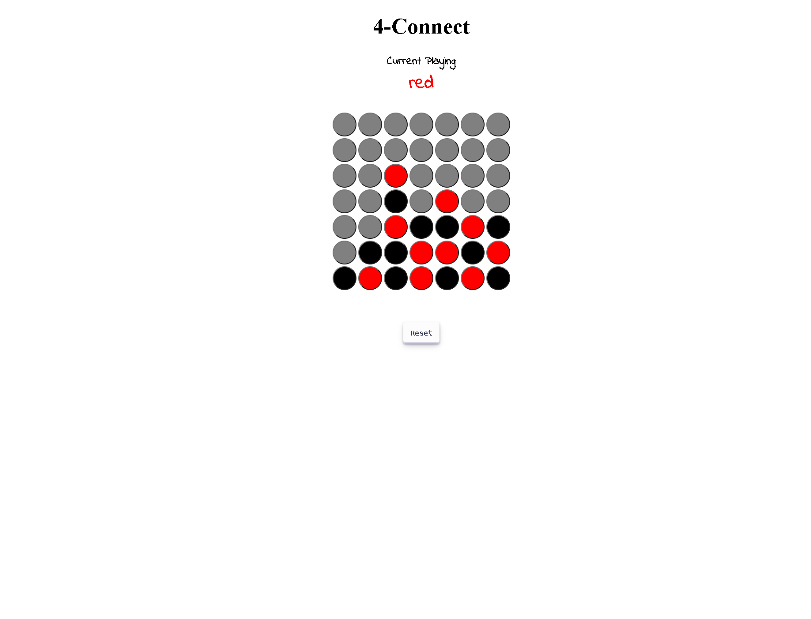

# Welcome to Sido's 4-connect

## Table of contents
* [General info](#general-info)
* [Instructions](#instructions)
* [API Integration](#api-Integration)
* [Contributing](#contributing)
* [Contact](#contact)

## General info

Play 4-connect with your friend!

## Instructions

1. Click on one of the circles to play.
2. Click on the reset button to reset the game.

## Contributing

Contributions are what make the open source community such an amazing place to learn, inspire, and create. Any contributions you make are greatly appreciated.

1. Fork the Project
2. Create your Feature Branch
3. Commit your Changes
4. Push to the Branch
5. Open a Pull Request

## Contact

Github: [@Yan Sidorenko](https://github.com/YanSido)

Project Link: [Sido's 4-connect](https://github.com/YanSido/4-connect/tree/YanSido-branch)

Github Pages: [https://yansido.github.io/4-connect/](https://yansido.github.io/4-connect/)
